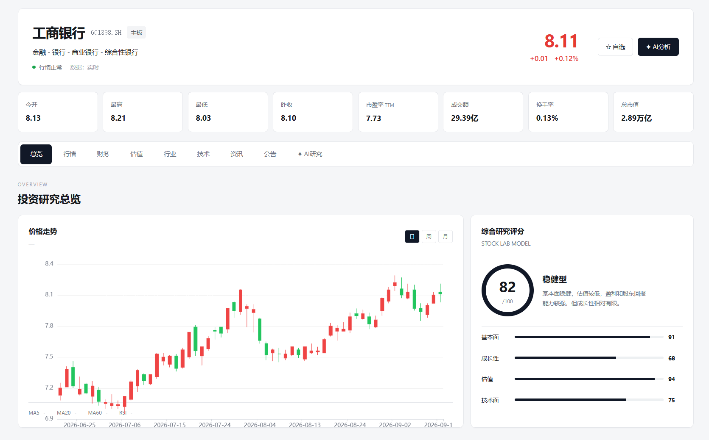
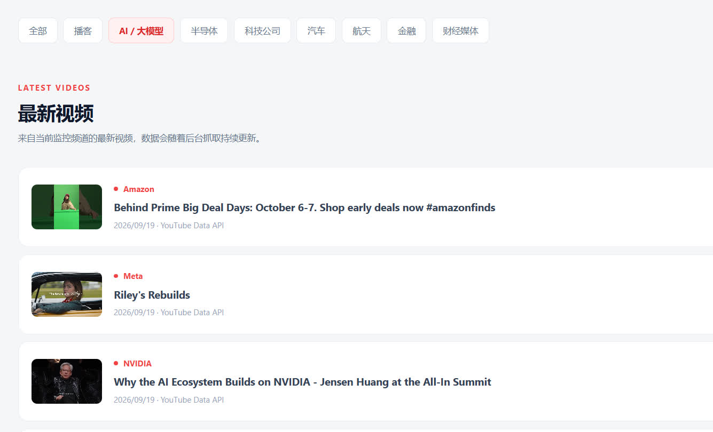
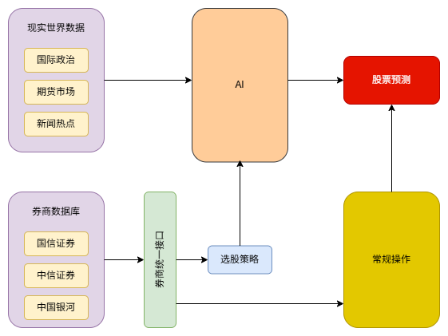

# Stock Lab

> 面向个人开发者与量化研究团队的行情分析与量化选股工具。

[](https://www.python.org/)
[](LICENSE)

---


这是一个面向股票投资研究的数据与分析平台，主要整合**行情数据、财经资讯、AI 分析、股票交易和可视化展示**等功能。

项目的目标是将股票研究过程中涉及的数据采集、信息分析、交易管理和结果展示统一起来，同时保持各模块之间的独立性，方便后续扩展和维护。

👉 点击 [股票研究中心](https://artinte.github.io/stock-lab/index.html) 进入项目首页，查看行情、财务、估值、行业、资讯、AI 研究等功能介绍与项目详情。
目前 GitHub Pages 仅提供静态页面展示，部分数据与交互功能需要本地运行项目后使用。

👉 点击 [学习文档](https://artinte.github.io/stock-lab/document/index.html) 进入股票投资学习文档，从股票基础开始，逐步学习股票市场、公司分析、财务报表、估值方法、投资风险以及个人投资框架。

或者进入 `stock-lab` 目录运行：

```
pip install -r requirements.txt
uvicorn infra.service.api:app --reload
```

打开浏览器输入： `http://127.0.0.1:8000/`

下面以工商银行（601398）为例，展示股票详情页面：

<p align="center">  </p>

行情及相关数据需要接入券商等数据源；即使暂未接入数据源，行情资讯模块也可独立使用。下面以 YouTube 信息流为例，展示项目对外部资讯信息流的监控与聚合：

<p align="center">  </p>

YouTube 信息流可以配置需要监控的频道，并自动获取最新视频，用于跟踪财经、科技、AI、公司及市场相关信息。

👉 欢迎关注 [STOCK LAB YouTube](https://www.youtube.com/@hello-stock-lab) 频道，获取 STOCK LAB 的产品更新、功能介绍、投资知识与市场研究相关内容。


## 主要功能

### 1. 券商与行情数据

支持接入不同的数据源和券商，目前包括：

* 银河证券
* 腾讯
* Binance（加密货币）
* 其他数据源可按统一接口继续接入

提供股票行情、K 线、财务数据、估值、行业信息等数据。

不同数据源相互隔离，上层业务通过统一接口访问，方便新增、替换和切换数据源。

### 2. 财经资讯与数据爬虫

通过独立的 Task 负责不同网站和不同类型的信息采集，例如：

* 财经新闻
* 政策信息
* 公司公告
* RSS
* 行业资讯
* 公司网站
* Youtube

不同爬虫任务相互独立，可以单独运行，也可以根据需求进行组合，并支持后续的数据清洗、去重、分析和信息推送。

### 3. AI 分析

对采集的财经资讯和股票数据进行 AI 分析，包括：

* 新闻和资讯总结
* 信息提取
* 市场情绪分析
* 股票基本面与技术面分析
* 股票涨跌趋势预测

将原始数据进一步转换成便于研究和决策的信息。

### 4. 股票交易

提供股票交易及持仓管理功能，包括：

* 买入
* 卖出
* 持仓
* 成交记录
* 成本计算
* 盈亏计算
* 收益率统计

### 5. 页面展示

通过 `docs/` 提供数据展示和交互界面，用于查看：

* 股票行情
* K 线
* 财务数据
* 估值
* 财经资讯
* AI 分析结果
* 持仓与交易
* 收益情况
* 市场信息


## 项目特点

### MVP 架构

项目采用 MVP 的设计思想，对 Model、业务逻辑和 View 进行分离。

* `core/models/`：存放系统核心数据模型
* `docs/`：页面展示
* 数据源、业务服务和任务模块独立组织

核心 Model 不依赖具体的数据来源，使不同数据源的数据能够统一到相同的数据模型中。

### 数据源隔离

项目通过 Gateway 对不同数据源进行统一抽象，并将数据获取与计算逻辑分离。

* DataManager 和 Gateway 提供统一抽象，具体实现放在底层对应的数据源目录
* 原始数据与计算数据分开，将大数据拆分为更小的数据模型，便于编写和维护
* 尽量传递原始参数，使 PE、PB 等指标能够统一计算

通过 Gateway 层实现数据源隔离，使上层业务不依赖具体数据源。

### Task 化设计

项目将数据处理流程拆分为独立 Task，使任务能够灵活组合。

* 源 Task：负责获取数据
* 处理 Task：负责数据处理和计算
* 目的 Task：负责保存、发布和输出结果

每个 Task 都可以独立运行，并根据需求任意组合。通过 Task 化设计，可以灵活组织不同的数据处理流程。

### 测试驱动

项目采用测试驱动的开发方式，`tests/` 中包含大量测试用例。

测试按照模块进行组织，可以单独测试：

* 数据模型
* 数据源 Gateway
* 爬虫任务
* AI 分析
* 业务功能

通过独立测试保证各模块能够正常运行，同时降低后续扩展和修改的风险。

### 组合设计

项目尽量采用组合（Composition）代替继承，将复杂功能拆分为多个职责单一的功能模块，通过组合不同模块构建完整业务能力。

* 将大型类拆分为多个独立的功能模块，避免单个类承担过多职责
* 通过组合 Gateway、Manager、Service 和 Task 等模块构建上层业务功能
* 不同模块之间通过明确的接口和数据模型进行协作，降低模块之间的耦合
* 各功能模块可以独立测试、替换和扩展，提高代码的复用性和可维护性

通过组合设计，可以在不修改核心模块的情况下替换数据源、调整业务流程或增加新的功能，使系统能够随着业务复杂度增长而持续扩展。


<a id="table-of-contents"></a>

## 📖 目录

* [项目简介](#project-introduction)
* [系统架构](#architecture)
* [核心功能](#core-features)

  * [智能数据感知与舆情系统](#crawler-feature)
  * [行情接入与技术指标引擎](#market-feature)
  * [人工智能分析与预测](#ai-feature)
  * [量化策略与股票筛选](#strategy-feature)

* [项目结构](#project-structure)

  * [common](#common)
  * [core](#core)
  * [crawler](#crawler)
  * [docs](#docs)
  * [gateways](#gateways)
  * [gui](#gui)
  * [tests](#tests)
  * [tools](#tools)
  * [utils](#utils)

* [系统安装](#installation)

  * [安装 Python 依赖](#install-python)
  * [安装 Ollama](#install-ollama)

* [快速开始](#quick-start)
* [量化分析界面](#quant-interface)
* [量化分析示例](#quant-example)
* [全市场量化选股](#market-selection)
* [股票预测实验](#stock-prediction)
* [数据接口](#data-interface)
* [路线图](#roadmap)
* [学习与扩展](#learning)
* [免责声明](#disclaimer)
* [Star](#star)

---

<a id="project-introduction"></a>

# 📌 项目简介

**Stock Lab** 是一款面向个人开发者与量化研究团队打造的**行情分析与量化选股工具**。

项目围绕：

> **数据采集 → 数据清洗 → AI 分析 → 技术指标计算 → 量化策略筛选 → 报告生成 → 消息推送**

构建完整的数据分析闭环。

系统主要由以下几个部分组成：

* **`crawler`**：财经新闻、交易所公告、政策文件等数据采集与 AI 分析。
* **`docs`**: 量化交易、股票分析、策略开发与系统架构等相关技术文档。
* **`gateways`**：券商行情数据接入，为上层策略提供统一的数据接口。
* **`tools`**：股票分析、指标计算、策略筛选、文本生成，视频总结等各种辅助工具。
* **`utils`**: 工具类，比如获取股票的名称，获取股票的分类，获取行业的市盈率等。

项目的核心目标是将：

> **时事热点 + 财经信息 + 行情数据 + 财务数据 + 技术指标 + AI分析 + 量化策略**


---

<a id="architecture"></a>

# 🏗️ 系统架构

```text
┌───────────────────────────────────────────────────────────────────────┐
│                       Stock Analysis 系统架构                          │
├───────────────────────────────────────────────────────────────────────┤
│                                                                       │
│  ┌──────────────────────┐       ┌──────────────────────┐             │
│  │   数据感知层 crawler  │ ────► │    AI 智能分析引擎    │             │
│  ├──────────────────────┤       ├──────────────────────┤             │
│  │ • 上交所公告          │       │ • 舆情去重            │             │
│  │ • 财经新闻            │       │ • 新闻摘要            │             │
│  │ • 央视财经            │       │ • 深度语义分析        │             │
│  │ • 东方财富            │       │ • 研报自动生成        │             │
│  │ • 商务部政策          │       │ • 本地 LLM / 云端 LLM │             │
│  │ • PDF / 网页数据      │       └──────────┬───────────┘             │
│  └──────────────────────┘                  │                         │
│                                            ▼                         │
│                              ┌──────────────────────────┐             │
│                              │      交易响应与应用       │             │
│                              ├──────────────────────────┤             │
│                              │ • 自动生成分析报告        │             │
│                              │ • 消息推送                │             │
│                              │ • 社区内容发布            │             │
│                              │ • 事件提醒                │             │
│                              └──────────────────────────┘             │
│                                                                       │
│  ┌──────────────────────┐       ┌──────────────────────┐             │
│  │  行情数据层 gateways  │ ────► │    技术指标计算引擎   │             │
│  ├──────────────────────┤       ├──────────────────────┤             │
│  │ • 券商行情接口        │       │ • MA                  │             │
│  │ • L1 / L2 数据        │       │ • MACD                │             │
│  │ • 实时行情            │       │ • RSI                 │             │
│  │ • 历史 K 线           │       │ • KDJ                 │             │
│  │ • 成交量              │       │ • BOLL                │             │
│  └──────────────────────┘       │ • WR / BIAS 等        │             │
│                                 └──────────┬───────────┘             │
│                                            │                         │
│                                            ▼                         │
│                              ┌──────────────────────────┐             │
│                              │     量化策略与选股系统    │             │
│                              ├──────────────────────────┤             │
│                              │ • 全市场股票筛选          │             │
│                              │ • 多因子策略              │             │
│                              │ • 技术面筛选              │             │
│                              │ • 基本面筛选              │             │
│                              │ • 盘中信号预警            │             │
│                              └──────────────────────────┘             │
│                                                                       │
└───────────────────────────────────────────────────────────────────────┘
```

## 系统架构图

<p align="center">
  
</p>

---

<a id="core-features"></a>

# 🚀 核心功能

<a id="crawler-feature"></a>

## 1. 🔍 智能数据感知与舆情系统

`crawler` 模块负责财经数据、官方公告以及政策信息的自动采集，并通过 AI 对非结构化内容进行清洗、分析和结构化处理。

它是一个独立的模块，拥有强大的拓展能力，`spiders` 集成了诸多需要抓取的网站，`pipelines` 继承了很多对内容的操作。在设计之初就考虑了不同的需求，可以直接通过配置满足。

比如抓取上海证券交易所的定期报告发布到雪球评论中。就可以通过如下配置解决：

```
# -s 指定使用的爬虫集合；-m 指定使用的任务集合
python crawler/main.py -s regular_report -m comment
```


### 多源数据采集

支持从不同数据源获取信息，例如：

* [上海证券交易所](https://www.sse.com.cn/)
* [深证证券交易所](https://www.szse.cn/index/index.html)
* [中证指数](https://www.csindex.com.cn/)
* [国证指数](https://www.cnindex.com.cn/)
* [央视财经](https://finance.cctv.com/)
* [东方财富网](https://www.eastmoney.com/default.html)
* 财经新闻网站
* 期货市场相关数据
* 股票市场热点信息
* [YouTube](https://www.youtube.com/)
* [x.com](https://x.com/home)
* 路透社

通过模块化 `spiders` 设计，可以方便地增加新的数据源。

同时通过 `pipelines` 对采集结果进行进一步处理。

### AI 分析

支持对接：

* 本地 [Ollama](https://ollama.com/)
* Qwen 等本地模型
* 云端大语言模型

对新闻、公告、政策等长文本进行：

```text
原始数据
   ↓
文本清洗
   ↓
内容去重
   ↓
AI 摘要
   ↓
事件提取
   ↓
投资逻辑分析
   ↓
结构化研报
```

例如提取央视财经网站的新闻：

```

```


### 自动生成研报

可以将抓取到的新闻、公告以及行情数据进行整合，自动生成：

* 个股分析
* 行业分析
* 事件分析
* 盘后点评
* 新闻摘要
* 投资逻辑分析

### 消息推送

分析结果可以进一步通过 API 推送到指定终端，例如：

* 企业微信
* 飞书
* 其他消息服务

从而形成：

> **数据采集 → AI 分析 → 自动推送**

的自动化流程。

### 内容发布

* 雪球帖子
* 小红书
* B站
* 同花顺

---

<a id="market-feature"></a>

## 2. 📊 行情接入与技术指标引擎

`gateways` 模块负责底层行情数据接入，将不同券商的数据接口与上层业务逻辑隔离。

### 统一行情接口

支持接入券商提供的：

* 实时行情
* 历史 K 线
* L1 行情
* L2 行情
* 成交量
* 成交额
* 市值
* 财务数据

通过统一接口进行封装，使上层策略不需要直接依赖具体券商的数据接口。

### 技术指标

系统提供多种常用技术指标，包括：

* MA
* MACD
* RSI
* KDJ
* BOLL
* WR
* BIAS

后续可以继续扩展更多技术指标与量化因子。

---

<a id="ai-feature"></a>

# 🤖 人工智能分析与预测

AI 模块负责将：

```text
热点信息
    +
财经新闻
    +
公司公告
    +
财务数据
    +
历史行情
    +
技术指标
    ↓
AI 分析
    ↓
股票 / 行业 / 市场洞察
```

进行统一整合。

系统支持本地 AI 模型，可以使用 Ollama 运行 Qwen 等模型，从而降低对外部 API 的依赖。

### AI 应用方向

主要包括：

* 财经新闻摘要
* 舆情分析
* 公司公告分析
* 财报分析
* 行业分析
* 个股分析
* 研报生成
* 事件驱动分析
* 股票预测实验

---

<a id="strategy-feature"></a>

# 📈 量化策略与股票筛选

系统支持对全市场股票进行批量筛选。

例如：

```text
营业收入同比增长 > 30%
        AND
PE(TTM) < 40
        AND
当前价格 > MA20
```

通过组合多个条件，可以构建不同类型的选股策略。

策略可以基于：

* 财务指标
* 估值指标
* 技术指标
* 成交量
* 市值
* 行业
* 涨跌幅
* 多因子评分

进行组合。

---

<a id="project-structure"></a>

# 🧩 项目结构

项目采用模块化设计，将：

> **数据采集、数据接口、分析逻辑、策略计算、AI 模型、结果展示**

进行拆分。

这样既可以单独运行某一个模块，也可以组合成完整的股票分析系统。

一个基本的项目结构如下：

```text
stock-lab/
│
├── crawler/
│   ├── spiders/
│   ├── pipelines/
│   ├── models/
│   └── ...
│
├── gateways/
│   ├── broker/
│   ├── market/
│   └── ...
│
├── tools/
│   ├── stock_detail.py
│   ├── stock_strategy.py
│   ├── stock_monitor.py
│   ├── stock_predict.py
│   ├── etf_list.py
│   └── ...
│
├── docs/res/
│   ├── 股票系统架构.png
│   ├── 量化界面.png
│   └── 广合科技示例图.jpeg
│
├── quick_start.py
├── requirements.txt
└── README.md
```

---

<a id="crawler"></a>

## `crawler`

负责财经数据采集。

主要功能：

* 财经新闻抓取
* 交易所公告抓取
* 政策文件抓取
* PDF 下载
* PDF 文本解析
* 数据清洗
* 数据去重
* AI 摘要
* 研报生成
* 消息推送

---

<a id="gateways"></a>

## `gateways`

负责券商行情数据接入。

核心思想是通过统一的数据接口将：

```text
券商数据源
     ↓
  gateways
     ↓
Stock Analysis
     ↓
策略 / AI / GUI
```

进行隔离。

因此，当底层数据源发生变化时，上层策略尽量不需要修改。

> ⚠️ 当前系统集成券商私有数据接口，目前主要支持 **中国银河证券 - 星耀数智平台**。
>
> 使用券商数据接口通常需要自行联系券商开通相应的数据权限。

---

<a id="docs"></a>

## `docs`

提供网站 [教学实践](https://artinte.github.io/stock-lab/)

---

<a id="stock-detail"></a>

## `stock_detail.py`

`StockDetail` 是股票数据分析的核心类之一，可以理解为整个系统的“数据心脏”。

主要包含：

### 基础行情

* 当前价格
* 开盘价
* 最高价
* 最低价
* 涨跌幅
* 成交量
* 成交额
* 换手率
* 总股本
* 流通股
* 总市值
* 流通市值

### 估值指标

* PE(TTM)
* 静态 PE
* 动态 PE

### 财务指标

* 营业收入
* 营业收入同比增长
* 净利润
* 净利润增长率
* 行业信息

### 技术指标

* MA3
* MA5
* MA10
* MA20
* MA30
* MA60
* WR
* BIAS

---

<a id="stock-strategy"></a>

## `stock_strategy.py`

量化策略引擎。

负责根据 `StockDetail` 提供的各种指标，对股票池进行批量筛选。

例如：

```python
if (
    stock.revenue_growth > 30
    and stock.pe_ttm < 40
    and stock.price > stock.ma20
):
    selected.append(stock)
```

通过修改条件即可快速构建新的量化选股策略。

---

<a id="stock-monitor"></a>

## `stock_monitor.py`

股票终端监控工具。

负责将 `StockDetail` 中的数据进行格式化，并以类似金融终端的形式输出。

例如：

```text
========================================
股票名称: 北方华创 (002371.SZ)
更新时间: 2026-01-20 00:00:00
----------------------------------------
现价: 514.2      开盘: 521.0
最高: 531.22     最低: 511.05
涨跌: -9.67      幅度: -1.85%
----------------------------------------
总股本: 7.24 亿股   总市值: 3725.26 亿元
流通股: 7.24 亿股   流通值: 3722.28 亿元
----------------------------------------
营业总收入: 273.01 亿元  (同比: 34.14%)
PE(TTM): 59.23
PE(静态): 66.27
PE(动态): 54.46
----------------------------------------
成交量: 7165317 股   成交额: 37.16 亿元
换手率: 0.99%        量比: 0.66
----------------------------------------
涨停: 576.26      跌停: 471.48
均价: 518.63      振幅: 3.85%
----------------------------------------
移动平均价 (MA):
MA3: 520.65
MA5: 512.40
MA10: 507.36
MA20: 488.25
MA30: 476.01
MA60: 447.17
----------------------------------------
威廉指标(14): 24.52
乖离率(5): 0.35%
========================================
```

---

<a id="stock-predict"></a>

## `stock_predict.py`

股票预测实验模块。

目前主要用于研究基于深度学习模型进行历史量价序列预测。

模型方向包括：

* Transformer
* Attention
* 时间序列预测
* 多变量输入预测

需要注意的是：

> 股票价格受到宏观经济、政策、行业周期、公司基本面、市场情绪、突发事件等大量外部变量影响，仅使用历史量价数据无法完整描述未来市场走势。

因此，该模块主要用于**机器学习与量化研究实验**。

---

<a id="installation"></a>

# 🛠️ 系统安装

## 1. 安装 Python 依赖

<a id="install-python"></a>

```bash
pip install -r requirements.txt
```

## 2. 安装 Ollama

如果需要使用本地 AI 模型，可以安装 [Ollama](https://github.com/ollama/ollama)。

Windows PowerShell：

```powershell
irm https://ollama.com/install.ps1 | iex
```

安装完成后，可以检查：

```bash
ollama --version
```

例如使用 Qwen：

```bash
ollama pull qwen3:8b
```

运行：

```bash
ollama run qwen3:8b
```

具体的使用方法可以参考 Ollama 官网。

---

<a id="quick-start"></a>

# 🚀 快速开始

如果只是希望快速了解项目，而暂时没有券商数据接口或 AI 环境，可以直接查看：

```text
quick_start.py
```

`quick_start.py` 提供了一个相对独立的基础示例。

它的特点是：

* 不依赖券商私有接口
* 不需要 AI 模型
* 使用准备好的数据
* 可以快速了解项目基本使用方式

运行：

```bash
python docs/quick_start.py
```

---

<a id="quant-interface"></a>

# 🖥️ 量化分析界面

项目集成 MCP（Model Context Protocol）交互引擎，可以通过自然语言与量化系统进行交互。

例如输入：

```text
苹果股票
```

系统可以自动识别：

```text
股票标的
    ↓
操作意图
    ↓
更新界面参数
    ↓
获取行情
    ↓
渲染分析结果
```

从而降低传统量化工具的使用门槛。

<p align="center">
  
  <br>
  <b>SmartQuant Studio 量化分析与自然语言交互界面</b>
</p>

---

<a id="quant-example"></a>

# 📊 量化分析示例

该工具支持核心数据回溯、多指标估值分析以及全市场策略筛选。

下面以 **广合科技（001389）** 为例，通过量化程序绘制近半年的：

* K 线
* PE-TTM

用于观察股价与估值之间的变化。

<p align="center">
  
  <br>
  <b>示例分析：广合科技（001389）K 线走势与 PE-TTM 估值变化</b>
</p>

<a id="pe-ttm"></a>

## PE-TTM

PE-TTM 计算规则：当前总市值 $\div$ 最近 4 个季度的净利润总和（即过去 12 个月的滚动利润）。

---

<a id="market-selection"></a>

# 📈 全市场量化选股

通过 `stock_strategy.py` 可以根据多个条件对全市场股票进行筛选。

例如：

```text
营业收入同比增长 > 30%
        AND
PE(TTM) < 40
        AND
当前价格 > MA20
```

量化多因子评价结果示例：

```text
【量化多因子评价报告】
================================================================================
代码        名称        行业       得分     市值      营收      现价    PE_TTM
000157.SZ   中联重科    工程机械      9      767.13    371.56     8.87    17.83
603236.SH   移远通信    通信设备      9      287.10    178.77    99.75    29.75
002245.SZ   蔚蓝锂芯    电池          9      226.84     58.14    19.66    31.54
601628.SH   中国人寿    保险          9    12925.45   5378.95    45.73     7.59
002131.SZ   利欧股份    互联网服务    8      568.83    144.54     8.40   116.29
600183.SH   生益科技    电子元件      8     1718.36    206.14    70.74    61.16
600105.SH   永鼎股份    通信设备      8      398.39     36.30    27.25   119.56
002080.SZ   中材科技    玻璃玻纤      8      665.71    217.01    39.67    37.75
002703.SZ   浙江世宝    汽车零部件    8      197.43     24.62    24.00   105.68
```

策略同样可以迁移到行业和 ETF 分析。

例如通过：

```text
etf_list.py
```

可以对不同 ETF、行业以及相关股票进行横向比较，从而减少只观察单一个股造成的局部视角问题。

---

<a id="stock-prediction"></a>

# 🔮 股票预测实验

除了传统量化分析之外，项目还提供基于历史数据的深度学习预测实验。

例如使用贵州茅台：

```text
600519.SH
```

输入过去一年的历史数据，对未来五个交易日进行预测。

### 训练过程

```text
开始基于 20 年数据训练 (设备: cuda)...

Epoch 200, Avg Loss: 0.237260
Epoch 400, Avg Loss: 0.178400
Epoch 600, Avg Loss: 0.110641
Epoch 800, Avg Loss: 0.085509
Epoch 1000, Avg Loss: 0.065867
```

### 预测结果

```text
600519.SH 未来 5 日预测 (当前: 1337.00)

T+1: 1270.80 (幅度: -4.95%)
T+2: 1281.24 (幅度: -4.17%)
T+3: 1151.77 (幅度: -13.85%)
T+4: 1218.93 (幅度: -8.83%)
T+5: 1245.81 (幅度: -6.82%)
```

> ⚠️ **重要说明**
>
> 以上预测结果仅为基于历史 20 年量价数据的深度学习实验，不构成任何投资建议。
>
> 当前模型处于封闭数据环境中，没有充分考虑：
>
> * 宏观经济
> * 货币政策
> * 地缘政治
> * 行业政策
> * 公司重大事件
> * 财报变化
> * 突发新闻
> * 市场情绪
> * 资金流向
>
> 因此，预测结果仅用于技术研究和模型实验。

---

<a id="data-interface"></a>

# 🔌 数据接口

本项目将数据层与分析层进行隔离。

整体结构：

```text
┌──────────────────────────┐
│       数据提供商          │
│                          │
│  券商 / 数据服务 / 爬虫   │
└────────────┬─────────────┘
             │
             ▼
┌──────────────────────────┐
│        gateways          │
│      统一数据接口         │
└────────────┬─────────────┘
             │
             ▼
┌──────────────────────────┐
│      Stock Analysis      │
│                          │
│  StockDetail             │
│  Strategy                │
│  AI                      │
│  Prediction              │
└──────────────────────────┘
```

这种设计可以避免业务代码直接依赖具体数据供应商。

未来可以扩展：

* 券商行情接口
* 通达信
* 同花顺
* 量化开放平台
* 其他金融数据 API

---

<a id="roadmap"></a>

# 🗺️ 路线图

项目仍在持续开发中。

## AI 与预测

* [ ] AI 趋势预测
* [ ] Transformer 时间序列预测
* [ ] 历史量价 + 财务数据联合建模
* [ ] 新闻事件 + 行情联合建模
* [ ] 行业趋势预测
* [ ] 指数走势预测

## 数据层

* [ ] 完善统一数据接口
* [ ] 支持更多券商数据源
* [ ] 支持更多量化开放平台
* [ ] 完善 L1 / L2 数据接口
* [ ] 增加历史数据缓存机制

## 量化策略

* [ ] 增加更多技术指标
* [ ] 增加基本面因子
* [ ] 增加多因子模型
* [ ] 增加行业轮动策略
* [ ] 增加 ETF 策略
* [ ] 增加盘中实时信号

## 可视化

* [ ] 集成 mplfinance
* [ ] 集成 Plotly
* [ ] 实时 K 线
* [ ] 技术指标叠加
* [ ] 财务数据可视化
* [ ] 估值历史分位数
* [ ] Web 量化分析看板

## AI 舆情

* [ ] 多源财经新闻爬虫
* [ ] 交易所公告自动抓取
* [ ] 研报自动摘要
* [ ] 新闻事件驱动分析
* [ ] 舆情热度分析
* [ ] 股票与新闻自动关联

## 宏观与外围市场

* [ ] 美股联动分析
* [ ] 港股联动分析
* [ ] 期货市场分析
* [ ] 大宗商品分析
* [ ] 外汇市场分析
* [ ] 全球市场时差分析

---

<a id="learning"></a>

# 📚 学习与扩展

项目后续计划逐步增加股票量化与金融数据分析相关 [教程](https://artinte.github.io/stock-lab/#tutorial) ，包括：

## 基础指标

* PE
* PB
* PS
* ROE
* ROIC
* EPS
* 营收增长率
* 净利润增长率

## 技术分析

* MA
* MACD
* RSI
* KDJ
* BOLL
* WR
* BIAS

## 量化策略

* 趋势策略
* 均线策略
* 动量策略
* 均值回归
* 多因子模型
* 行业轮动
* ETF 策略

## AI 与量化

* Transformer
* 时间序列预测
* LLM
* RAG
* MCP
* AI 财经舆情
* 事件驱动分析

---

<a id="disclaimer"></a>

# ⚠️ 免责声明

本项目及仓库中的所有代码、数据、模型、示例和分析结果，仅用于：

* 技术研究
* 编程学习
* 机器学习实验
* 金融数据分析研究
* 量化策略研究

**不构成任何形式的投资建议、证券推荐或交易指导。**

股票、基金、期货等金融市场具有高风险。

特别是机器学习模型的历史回测和预测结果，并不代表未来收益，也不能保证模型在真实市场环境中有效。

使用本项目进行任何实际投资决策所产生的风险，由使用者自行承担。

## ⚠️ 法律免责声明与风险提示 (Disclaimer)

### 1. 合规与免责 (Legal & Compliance)
* **非投资建议**：本项目（`stock-lab`）及其相关代码仅供**学术研究、技术交流与量化策略测试**使用，不构成任何形式的投资建议、财务顾问意见或交易指引。
* **风险自负**：股市有风险，投资需谨慎。投资者基于本项目提供的代码、数据、策略或 AI 生成的报告所做出的任何投资决策，其产生的直接或间接盈亏及法律责任均由使用者自行承担，本项目开发者及贡献者不承担任何责任。

### 2. 爬虫与自动化行为约束 (Crawler & Automation Usage)
* **版权与协议**：使用者在运行 `crawler` 模块时，须严格遵守目标网站（如上交所、央视财经、东方财富等）的 `robots.txt` 协议及相关法律法规。本项目仅提供技术框架，不针对任何特定网站提供突破反爬、非法侵入或越权获取数据的功能。
* **社区发布合规**：自动化评论与社区互动功能仅限用于个人自动化测试。使用者不得将本项目用于发送垃圾广告、恶意灌水、散布虚假证券信息或操纵舆论等违法违规行为。

### 3. 数据来源声明 (Data Sources)
* 本项目引用的所有公开行情数据与财报公告均来源于第三方公开接口，本项目不保证数据的实时性、准确性与完整性。

---

<a id="star"></a>

# ⭐ Star

如果这个项目对你有帮助，欢迎点一个 **Star ⭐**。

你的 Star 是继续开发和完善这个项目的重要动力。

---

<p align="center">
  <b>Stock Analysis</b>
  <br>
  AI × Quant × Finance
</p>
